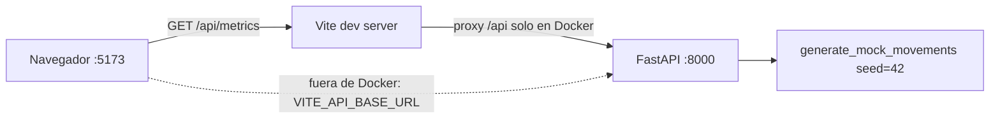

# Patrones del sistema

## Arquitectura

Son dos servicios sin estado ni base de datos. El frontend hace **una sola llamada** y calcula todo en el cliente.

## Backend (`backend/app/`)

- **`main.py`:** crea `FastAPI(title="Financial Metrics API")`, añade CORS e incluye `router`.
- **`routes.py`** es un único módulo (391 líneas) que contiene:
  - alias `Literal` (`OperationType`, `Category`, `BusinessType`, `GroupBy`);
  - modelos Pydantic (`FinancialMovement`, `MetricsFacets`, `MetricsSummaryItem`, `TopCategoryItem`, `MetricsComparison`, `MetricsAlert`);
  - el generador `generate_mock_movements` / `_build_movement`;
  - helpers puros (`filter_movements`, `summarize_movements`, `build_top_categories`, `calculate_net_value`, `detect_outcome_alerts`);
  - los endpoints.
- **Patrón de cada endpoint:** generar datos → filtrar → agregar → devolver un `response_model`. La validación la hacen los tipos y `Query(ge, le)`, que devuelven 422 automáticamente.

| Endpoint | Parámetros | Respuesta | Lo usa el frontend |
|---|---|---|---|
| `GET /health` | — | `{"status":"ok"}` | no |
| `GET /api/metrics` | `start_date`, `end_date`, `category`, `operation_type` | `FinancialMovement[]` | **sí** (`App.tsx`) |
| `GET /api/metrics/facets` | — | tipos, categorías, `min_date` y `max_date` | no |
| `GET /api/metrics/summary` | `group_by` (day/week/month), fechas, `category`, `operation_type`, `business_type` | income/outcome/net por periodo | no |
| `GET /api/metrics/categories/top` | `operation_type`, `limit` (1-20), fechas, `business_type` | top de categorías | no |
| `GET /api/metrics/comparison` | `start_date` y `end_date` obligatorios, `business_type` | neto actual frente al periodo anterior | no |
| `GET /api/metrics/alerts` | `threshold` (≥0, por defecto 0.3), `group_by`, fechas, `business_type` | periodos con gasto por encima de la media previa | no |
| `GET /api/metrics/b2b` y `/b2c` | igual que `/api/metrics` | `FinancialMovement[]` filtrados | no |

## Frontend (`frontend/src/`)

- **`App.tsx`:**
  - `useEffect` → `fetch(\`${API_BASE_URL}/api/metrics\`)`;
  - estados `metrics`, `monthlyData`, `period`, `loading` y `error`;
  - compone el header, `KPIRow` y los 2 gráficos.
- **`lib/financial-utils.ts`:** funciones puras `computeKPIs`, `computeMonthlyData`, `formatPeriodLabel`, `formatCurrency` y `formatPercent`. Son la única lógica con tests.
- **`lib/financial-types.ts`:** copia manual del contrato del backend en `snake_case`, más tipos de cliente (`KPIMetrics`, `MonthlyDataPoint`).
- **`components/dashboard/`:** componentes de presentación, que reciben props y `loading`. **`components/ui/`:** primitivas shadcn.
- **`lib/mock-data.ts`:** sin uso (datos de 2024), pero `tsc` lo compila.

## Convenciones

Las reglas completas están en `.agents/rules/`.

- **Contrato duplicado a mano** entre `routes.py` y `financial-types.ts`: se cambia en los dos lados (`api-contract.md`).
- **Archivos:** kebab-case. **Componentes:** PascalCase con exportación nombrada. **Imports:** alias `@/`.
- **Estilo por archivo**, sin formateador: comillas dobles con `;` en `App.tsx` y `financial-utils.ts`; comillas simples sin `;` en los componentes.
- **Tests:**
  - backend en `backend/tests/test_routes.py`, ejecutados desde `backend/`;
  - frontend junto a `financial-utils.ts`;
  - sin fechas fijas en los tests del backend, porque los datos son relativos a hoy.
